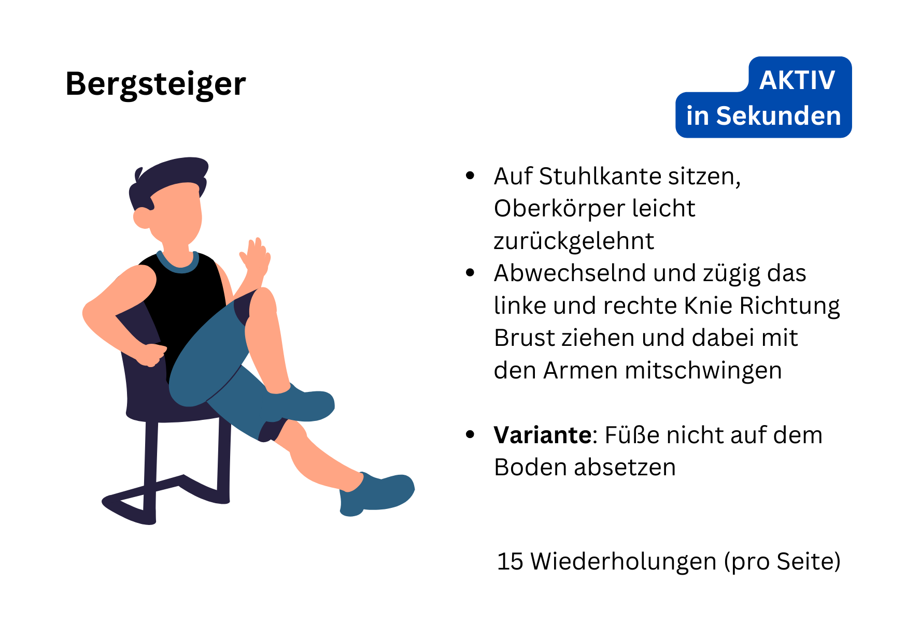

# Toolbox
Kurze Übungen mit Bildern und Textanleitungen.

  <a href="#" id="openGallery" style="display:inline-block; text-decoration:none;">
    

      
      
Galerie öffnen

      
2 Bilder (Probe) – klicken zum Durchblättern

    

  </a>

<link rel="stylesheet" href="https://unpkg.com/photoswipe@5/dist/photoswipe.css">

  
  

# Poster
Vier Poster mit Übungsbeispielen und Ideen zur Ritualisierung in Deinem Alltag.

# 30-Tage-Challenge
Challenge-Vorlagen, um Deine Erfolge zu tracken und im Team mit- bzw. gegeneinander anzutreten.

# Sticker und Hintergrundbilder
Zur Erinnerung an Deine aktiven Sekunden.

# Kontakt
Weitere Informationen unter:
